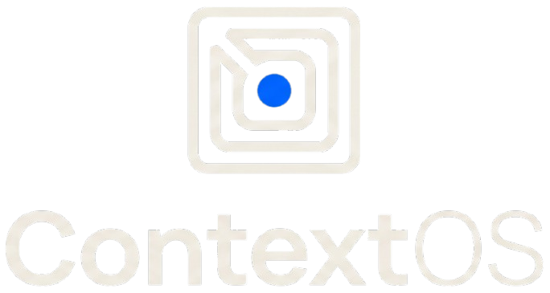

<p align="center">
  
</p>

### The Physical Machine for Exploring & Reasoning Over Knowledge


[](https://react.dev)
[](https://vitejs.dev)
[](https://threejs.org)
[](https://tailwindcss.com)
[](https://fastapi.tiangolo.com)
[](http://localhost:1234/v1)
[](LICENSE)

> **Visual Philosophy**: Modern AI laboratory × futuristic workstation × digital skeuomorphism × 3D data visualization.  
> Not generic AI SaaS with purple gradients and floating cards — instead, a physical-looking machine for exploring and reasoning over knowledge with real tactile micro-interactions, paper-like document cards, file cabinets, rotary knobs, mechanical keyboard keycaps, and Web Audio synthesized acoustic feedback.

---

## 🖥️ 17 Landing Page Sections

1. **Hero — Local Intelligence, Your Context**:
   - Modern workstation desktop viewport, central glowing "Context Core" apparatus with rotating magnetic containment rings.
   - Pinned sticky notes with pushpins, mechanical keyboard command keycaps (`[TAB] Console`, `[SPACE] Ingest`, `[ENTER] Query`).
   - Web Audio synthesized mechanical sound feedback toggle (🔊 Sound ON/OFF).
2. **Live RAG Pipeline**:
   - 5-stage physical signal conveyor / patchbay (Intake ➔ Cleaver ➔ 768-D Encoder ➔ Cosine Matcher ➔ Synthesis).
3. **How ContextOS Works**:
   - Layered desktop workstation windows with macOS/NeXT-style rivet buttons demonstrating modular internal pipelines.
4. **Knowledge Ingestion**:
   - 3 physical pull-out cabinet drawers (`Academic`, `Security`, `Financial`).
   - Paper-like document cards (`paper-card`) with realistic drop shadows, fiber warmth, and folded corners.
5. **Semantic Retrieval**:
   - Magnifying-glass vector inspector focusing on individual chunk cards with real-time cosine proximity gauges.
6. **Context Assembly**:
   - Stacked physical context layers with magnetic snapping interaction and visual token budget fill gauge.
7. **Local LLM Generation**:
   - Phosphor CRT terminal screen with real-time typewriter token streaming, rotary temperature dial, and token rate meter.
8. **Interactive 3D Knowledge Space**:
   - Embedded Three.js 3D spatial knowledge map (`Interactive3DKnowledgeMap.jsx`) with raycasting, hover HUD, orbit speed and spatial spread controls.
9. **Source & Citation Explorer**:
   - Manila folder tabs (`folder-tab`) with pinned sticky notes, exact source excerpt clips, and grounded confidence badges.
10. **RAG Performance / Evaluation**:
    - Tactile laboratory instrument bench with dual analog needle meters (`SkeuoMeter`), latency chronometers, and hit-rate indicators.
11. **Privacy & Local-First AI**:
    - Physical air-gap isolation knife-switch / breaker toggle (`SkeuoSwitch`), blinking disk storage LEDs, zero-cloud security seal.
12. **Supported Documents & Models**:
    - Physical cartridge slots for PDF, DOCX, TXT, CSV, JSON; and hot-swappable local models (Qwen 3.5, Gemma 2B/4B, Llama 3).
13. **Technical Architecture**:
    - Dark grid blueprint schematic detailing the 127.0.0.1:1234 Bionic loopback bus and FastAPI socket.
14. **Interactive Demo**:
    - Live hands-on mini workbench right on the landing page! Query selector buttons, live needle deflection, and typewriter answer streaming.
15. **Developer / Open Source**:
    - Mechanical terminal code card with physical copy button and CLI installation keys.
16. **Final CTA — Build With Your Context**:
    - Workstation console ignition switch with primary "ENGAGE CONSOLE NOW" action.
17. **Footer**:
    - Laboratory workstation backplate with corner screws, status diodes, page routing links, and serial stamp.

---

## 🌟 Architectural Differentiation

| Evaluation Metric | Standard College Streamlit App | **ContextOS Digital Skeuomorphic Console** | Cloud SaaS (OpenAI / AWS) |
| :--- | :--- | :--- | :--- |
| **Interface Design** | Basic flat Python forms | **Modern Digital Skeuomorphism & Workstation Metaphor** (Paper cards, file cabinet, context core, mechanical keycaps) | Generic flat web SaaS |
| **Tactile Components** | Plain sliders & dropdowns | **Physical Rotary Potentiometers, Rocker Switches & Analog VU Meters** | Standard HTML inputs |
| **3D Data Visualization** | None | **Interactive Three.js 3D Spatial Knowledge Constellation** with raycasting HUD | None |
| **Acoustic Feedback** | None | **Web Audio API Synthesized Mechanical Clicks & Thunks** | None |
| **Dedicated Pages** | 1 single linear page | **7 Dedicated Hardware Pages** (Console Deck, Mainframe Dashboard, Operator Clearance, Terms Plate, Storage Manifest, Privacy Guarantee, Technical Manual) | Complex multi-tenant portal |
| **Data Privacy** | Often temp files or cloud keys | **100% Air-Gapped Local Inference** (0 Outbound WAN packets) | Documents sent to remote servers |
| **Offline Resilience** | Crashes on connection loss | **Adaptive Standby Synthesizer** (Never crashes; instant semantic retrieval) | Fails on internet interruption |
| **Recurring Cost** | $0.00 or API charges | **$0.00 Forever** (Runs on local GPU / CPU) | High per-token billing |

---

## 🚀 Quickstart Guide

### 1. Prerequisites
- Python 3.10+
- Node.js 18+ and npm
- [LM Studio / Bionic](https://lmstudio.ai/) running locally on port `1234` with an embedding model (`text-embedding-nomic-embed-text-v1.5`) and chat model (e.g. `qwen/qwen3.5-9b` or `google/gemma-4-e2b`).

### 2. Installation
```bash
# Clone repository
git clone https://github.com/pranav-6944/ContextOS.git
cd ContextOS

# Install backend dependencies
pip install -r requirements.txt

# Install frontend dependencies and build SPA
cd frontend
npm install
npm run build
cd ..
```

### 3. Launch ContextOS
```bash
python run.py
```
Open your browser to:
👉 **[http://localhost:8000](http://localhost:8000)**

---

## 📜 License
Released under the [MIT License](LICENSE). Architected by Pranav for the AGAI Lab Project Showcase.
